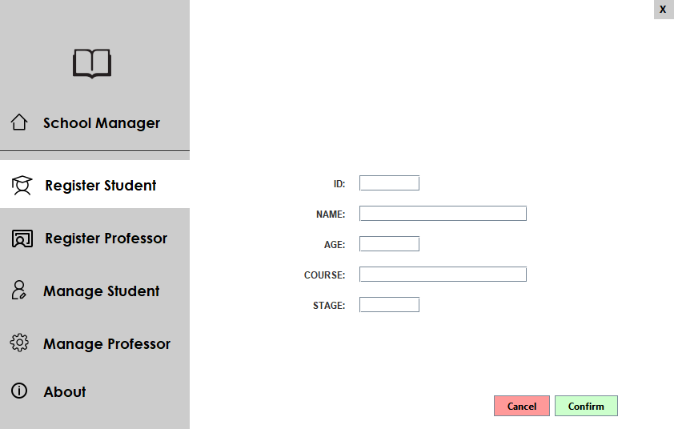
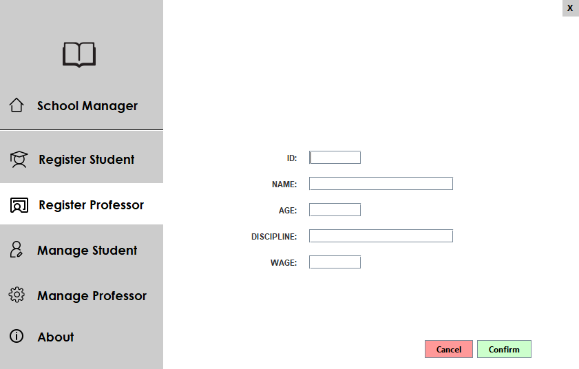
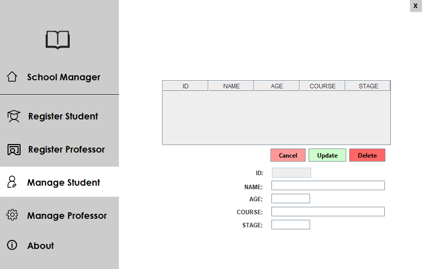
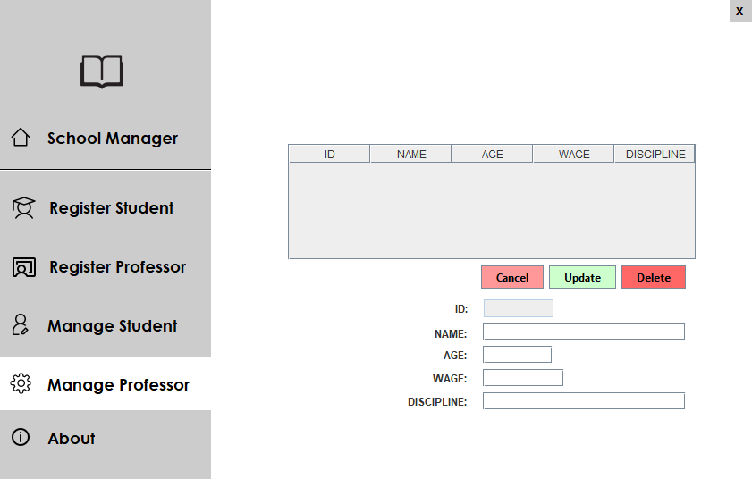

<h1 align="center">School Management System</h1>

<p align="center">Welcome to the School Management System repository! This Java application, backed by a MySQL database, allows you to efficiently manage students and professors within a school environment. Keep track of student and teacher information, perform updates, and manage deletions, all through a user-friendly interface.</p>

## 🎯 Features

- Add students and teachers with the following details:
  - Student: ID, Name, Age, Course, Stage
  - Professor: ID, Name, Age, Discipline, Wage

- View a tabular representation of all students and teachers.

- Update student and teacher information as needed.

- Delete student and teacher records.

## ⚙ Prerequisites

Before you begin, ensure you have met the following requirements:
- Java Development Kit (JDK) installed
- MySQL installed
- MySQL database named "school_managerdb"
  - Table "student" into "school_managerdb" with following columns:
    - int **_id_student_** Primary Key and Not Null;
    - varchar **_name_student_** Not Null;
    - int **_age_student_** Not Null;
    - varchar **_course_student_** Not Null;
    - int **_stage_student_** Not Null.
      
  - Table "professor" into "school_managerdb" with following columns:
    - int **_id_professor_** Primary Key and Not Null;
    - varchar **_name_professor_** Not Null;
    - int **_age_professor_** Not Null;
    - int **_wage_professor_** Not Null;
    - varchar **_discipline_professor_** Not Null.
 
## 📦 Installation

1. Clone this repository to your local machine:
```git clone https://github.com/your-username/school-management.git```
2. Open this project in your favorite IDE
3. Put your mySQL user and password in ```Connection\Conn.java```
4. Compile and run the code or dowload compiled version [here](dist/management_school.jar?raw=true) (after having put the password and username on code)
5. Follow the GUI to use the application

## 🤝 Contributing
Contributions are welcome! Please fork the repository and create a pull request with your proposed changes. For major changes, please open an issue first to discuss your ideas.

## 📄 License
This project is licensed under the [MIT](LICENSE.txt)<br>
[](https://opensource.org/licenses/MIT)
<br>
<br>
<br>

## 📸 Screenshots
<div style="display: flex;">
   <p align="center">
      
      
      
      
   </p>
</div>
